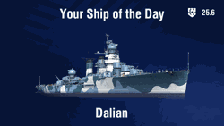

[中文](README.md) | **English**

# Your Ship of the Day (ChooseUrShip)

## Preview

Lesta：

[View Full Size](lesta/en/normal.gif)

Wargaming：

[View Full Size](wg/en/normal.gif)

## Introduction

Provide two sizes of GIFs that cycle in a random, non-repeating order through all ships from World of Warships or Mir Korabley that meet the following criteria:

- Tier VIII-★ premium/special ships
- Tier X or ★ researchable/early-access ships

## Layout

- Centered **Choose Your Ship** at the top.
- Icon and version of the server at the top-right corner.
- Ship icon in the center.
- Ship’s name at the bottom center.

## Credits

[Python](https://github.com/python) and [Pillow](https://github.com/python-pillow/Pillow) made auto-generating GIFs possible;

[JetBrains](https://github.com/jetbrains) developed a free and efficient Python IDE — PyCharm Community Edition;

[LocalizedKorabli](https://github.com/LocalizedKorabli) provided localizations for Mir Korabley.

## License

[CC0-1.0](LICENSE)
